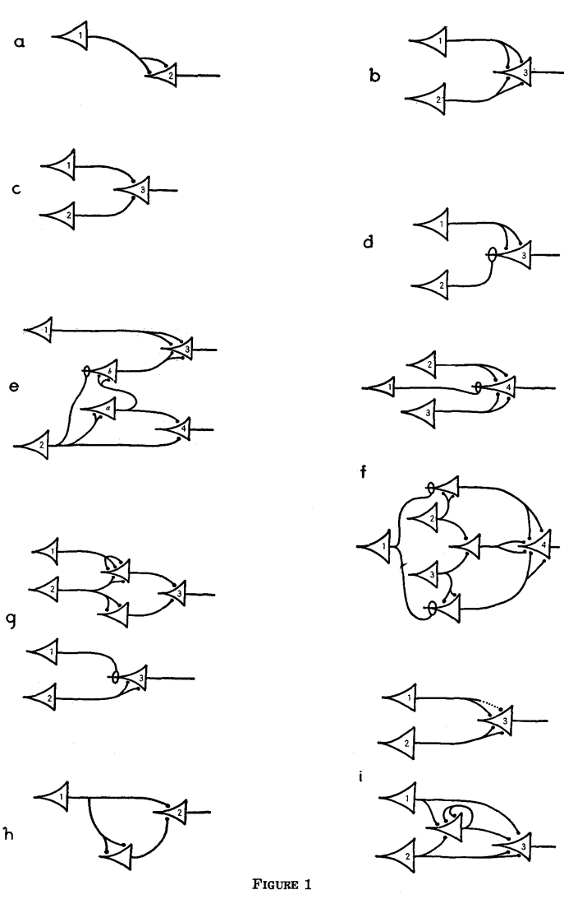

# 神经活动内在思想的逻辑演算

_A Logical Calculus of the Ideas Immanent in Nervous Activity_

**Warren S. McCulloch 　 Walter Pitts**

伊利诺伊大学医学院精神病学系（伊利诺伊神经精神病研究所）暨芝加哥大学

_《数理生物物理学通报》（Bulletin of Mathematical Biophysics）第 5 卷，1943 年_

## 摘要

因为神经活动具有"全或无"（all-or-none）的性质，神经事件及其相互关系可以用命题逻辑来处理。本文发现，每一张网络的行为都可以用命题逻辑来描述——对于含有环路的网络，还需要补充更复杂的逻辑手段；并且，对于任何满足特定条件的逻辑表达式，都可以找到一张按其描述方式行动的网络。本文还证明，在诸多可能的神经生理学假设之间进行的许多具体选择其实是等价的：在某一假设下行为如此的每一张网络，都存在另一张在别的假设下行为一致（尽管未必用时相同）的网络，能给出相同的结果。文中讨论了这套演算的各种应用。

## 一、引言

理论神经生理学建立在若干基本假设之上。神经系统是由神经元构成的网络，每个神经元都有一个胞体（soma）和一根轴突（axon）。它们的连接，即突触（synapse），总是发生在一个神经元的轴突与另一个神经元的胞体之间。任一时刻，神经元都具有某个阈值，兴奋必须超过这个阈值才能引发一次神经冲动；这个阈值（除了冲动是否发生及发生的时刻之外）是由神经元本身决定的，而不是由兴奋决定的。从兴奋点出发，冲动会传播到神经元的所有部分。沿轴突传导的速度与轴突直径成正比：细轴突（通常也较短）的传导速度不到每秒 1 米，粗轴突（通常也较长）的传导速度可超过每秒 150 米。因此，轴突传导所需的时间，对于确定冲动到达那些距同一来源远近不等的各点的先后顺序，其重要性很小。跨突触的兴奋主要是从轴突末梢传向胞体的。至于这究竟是由于单个突触本身具有不可逆性，还是仅仅由于普遍存在的解剖构型所致，目前仍有争议。假设是后者不需要额外的特设假说，而且能解释已知的例外情况，但对于原因的任何假设都与后文的演算相容。目前尚未发现任何一个案例，是单个突触的兴奋就能在任何神经元中引发一次神经冲动的；反之，任何神经元都可能因足够数量的邻近突触在"潜伏叠加期"（该时期不到四分之一毫秒）内被激发而受到兴奋。已观测到的、间隔更长时间的冲动的时间叠加，对单个神经元而言是不可能的，其在经验上取决于网络的结构性质。从冲动到达神经元，到该神经元自身传播出冲动，之间存在超过半毫秒的突触延迟。在神经冲动的最初阶段，神经元对任何刺激都绝对不应期；此后其兴奋性迅速恢复，有时会先升高到高于正常值，然后再降到低于正常值，最后缓慢恢复到正常水平。频繁的活动会加剧这种低于正常的状态。神经冲动所具有的特异性，仅仅取决于其发生的时间和地点，而不取决于神经能量的任何其他特异性。近来，唯一被认真提出来反驳这一论点的现象是抑制。抑制是指一组神经元的活动，被另一组神经元同时或先前发生的活动所终止或阻止。直到最近，这还可以用如下假设来解释：第二组神经元先前的活动，可能会提高中间神经元（internuncial neurons）的阈值，使它们不再能被第一组神经元兴奋，而第一组神经元的冲动必须与这些中间神经元的冲动相加，才能兴奋那些现在被抑制的神经元。但如今，已经证明有些抑制过程耗时不到一毫秒——这就排除了中间神经元参与的可能，而要求存在这样的突触：通过它传来的冲动，能直接抑制正在被其他突触上的冲动刺激的那个神经元。目前实验尚未表明这种不应期究竟是相对的还是绝对的。我们将假设它是绝对的，并会证明这一区别对我们的论证并无实质影响。这两种不应期，都可以用以下两种方式之一来解释："抑制性突触"可能是这样一种突触：它产生某种物质，从而提高神经元的阈值；也可能是这样一种突触：其兴奋所产生的局部扰动，与其他兴奋性突触所诱发的改变正好相反、相互抵消。鉴于位置因素在电刺激情形下已知会产生此类效应，第一种假设在被证实之前应当排除，因为第二种假设不需要引入任何新的假说。于是，我们对抑制现象有了两种基于相同一般前提、仅在所假设的神经网络（因而在抑制所需时间）上有所不同的解释。此后，我们将把这样的神经网络称为"广义等价"（equivalent in the extended sense）。既然我们关心的是在这种等价关系下保持不变的网络性质，我们就可以采用对演算最方便的物理假设。

许多年前，我们中的一位，出于与本文论证无关的考虑，产生了这样的构想：任何神经元的反应，事实上都等价于一个陈述其充分刺激条件的命题。他因此尝试用命题符号逻辑的记法来记录复杂网络的行为。神经活动的"全或无"律，足以保证任何神经元的活动都可以表示为一个命题。神经活动之间存在的生理关系，当然对应于命题之间的关系；而这种表示法是否有用，取决于这些关系是否与命题逻辑中的关系相一致。对于任何神经元的每一次反应，都存在一个相应的简单命题的断言。而这个命题，又会蕴含另一个简单命题，或者蕴含若干类似命题的析取或合取（可能带有否定），具体形式取决于该神经元上突触的配置及其阈值。这里出现了两个困难。第一个涉及易化（facilitation）与消退（extinction）：先前的活动会暂时改变网络中同一部分对后续刺激的反应性。第二个涉及学习：某些先前时刻同时发生的活动，会永久性地改变网络，使得原本不足以引发反应的刺激，现在变得足够了。但是，对于经历这两种改变的网络，我们可以用连接和阈值都不发生改变的、由神经元构成的等价虚拟网络来替代它们。但有一点必须说清楚：我们两人都不认为这种形式上的等价就是事实上的解释。恰恰相反——我们认为，易化与消退依赖于与电、化学变量（如后电位和离子浓度）相关的阈值连续变化；而学习则是一种能够经受睡眠、麻醉、抽搐和昏迷考验的持久性改变。这种形式等价的重要性在于：真正支撑易化、消退和学习的那些改变，丝毫不会影响我们从神经网络活动的形式化处理中所得出的结论，相应命题之间的关系仍然遵循命题逻辑的关系。

神经系统中包含许多环路（circular paths），其活动会不断再生地激发参与其中的每一个神经元，以至于对过去时间的指涉变得不确定——尽管它仍然意味着，传入活动已经实现了某个时间历程上某一类构型中的某一种。用递归函数对这些蕴含关系加以精确说明，并确定其中哪些可以在神经网络的活动中被具体实现，就完成了这套理论。

## 二、理论：无环网络

九种基本神经元连接方式

这张"Figure 1"是全文最核心的图示，展示了论文里反复用到的**九种基本神经元连接方式**（a 到 i），每一种都对应一个具体的逻辑运算。图中三角形代表神经元（cell body 内的数字是编号），带小圆圈的连线表示抑制性突触，没有圆圈的普通连线表示兴奋性突触。

对照正文，每个子图的含义是：

- **a**：单纯的延迟传递——神经元 1 发放，一个突触延迟后神经元 2 跟着发放（$N_2(t)\equiv N_1(t-1)$），这是最基本的"顺承"（precession）操作
- **b**：析取（"或"）——1 或 2 任一发放，都会使 3 发放
- **c**：合取（"与"）——1 和 2 必须同时发放，3 才发放
- **d**：合取+否定（"与非"）——1 发放且 2 不发放时，3 才发放。注意 d 里 2 到 3 的连线带小圆圈，表示抑制
- **e**：把 a-d 这几个基本元件组合起来，实现的是正文里"冷刺激先感觉热"那个例子——即 $N_3, N_4$ 的复合表达式
- **f**：用绝对抑制去替代"相对抑制"的例子（对应定理 IV）
- **g**：用环路结构去实现"消退"（extinction）现象的例子（对应定理 V）
- **h**：用空间叠加去替代"时间叠加"的例子（对应定理 VI），插入了延迟链
- **i**：用环路去实现"可变突触"（也就是模拟学习）的例子（对应定理 VII），图里那个绕圈的连线就是新形成的、自我强化的回路

**这张图的意义**在于：作者证明了，只要有 a、b、c、d 这四种最基本的"逻辑门"（延迟、或、与、与非），就可以像搭积木一样，把它们组合出任意复杂的神经网络行为（e-i 就是具体的搭建示范）。这本质上就是"最小逻辑门集合可以构造任意布尔电路"这个思想在神经元网络上的最早呈现——后来数字电路设计里"与非门是万能门"的思路，跟这里的逻辑是一脉相承的。

我们将为这套演算作出以下物理假设。

1. 神经元的活动是一种"全或无"的过程。
2. 在任一时刻要激发某个神经元，必须有固定数量的突触在"潜伏叠加期"内被激发；这个数量与此前的活动及在神经元上的位置无关。
3. 神经系统中唯一显著的延迟是突触延迟。
4. 任何一个抑制性突触的活动，都绝对地阻止该神经元在此刻被激发。
5. 网络的结构不随时间改变。

为了呈现这套理论，最合适的符号系统是 R. Carnap（1938）的"语言 II"，并补充了取自 B. Russell 与 A. N. Whitehead（1927）的若干记法，包括《数学原理》（_Principia_）中使用圆点的习惯写法。但由于排版上的限制，我们将用正体的 "E" 代替倒置的存在量词符号，并用箭头（"→"）代替马蹄形符号来表示蕴含。我们也会使用 Carnap 的语法记号，但改用黑体印刷，而非哥特体；此外我们引入一个算子 S，其对某个性质 P 的取值，是这样一个性质：当 P 对某数的前一个数成立时，S(P) 就对该数成立；其定义为 `S(P)(t) . ≡ . P(κx) . t = x')`。它的自变量外的括号常常会被省略，此时应理解为紧邻其右侧的最近一个谓词表达式 [Pr]。此外，我们将用 S²Pr 表示 S(S(Pr))，依此类推。

给定网络 𝒩 中的各神经元，可以分别标记为 'c₁'、'c₂'、……、'cₙ'。这样一来，我们就用带下标数字 i 的 'N' 来表示这样一个关于数的性质：神经元 cᵢ 在距时间起点该数目个突触延迟处的那个时刻发放，于是 Nᵢ(t) 断言 cᵢ 在时刻 t 发放。Nᵢ 称为 cᵢ 的**行动**（action）。我们有时会把 'N' 的下标数字当作属于对象语言的一部分，仿佛它占据的是某个函子的自变量位置，因而可以用一个数变元 [z] 来替换，并对其加以量化；这使我们能够用一个算子，来简写那些虽然有限但很长的析取式和合取式。我们将对一系列的 Pr 普遍采用这种表达方式；这可以通过一个显然的析取式定义来形式化地确立。谓词 'N₁'、'N₂'、……共同组成语法类 'N'。

我们把 𝒩 的**外周传入神经元**（peripheral afferents）定义为 𝒩 中没有轴突投射到其上的那些神经元。设 N₁, ⋯, Nₚ 表示这些神经元的行动，N*{p+1}, N*{p+2}, ⋯, Nₙ 表示其余神经元的行动。那么，𝒩 的一个**解**（solution），就是一组形如 Sᵢ: N*{p+1}(z₁) . ≡ . Prᵢ(N₁, N₂, ⋯, Nₚ, z₁) 的语句，其中 Prᵢ 除了 z₁ 以外不含自由变元，除了自变量 [Arg] 中的 N 以外不含描述性符号，可能还含有一些常量语句 [sa]；并且每个 Sᵢ 对 𝒩 都为真。反过来，给定一个除了自变量中的变元外不含自由变元的 Pr₁('p¹₁, 'p¹₂, ⋯, 'p¹ₚ, z₁, s)，如果存在一张网络 𝒩 以及其中的一系列 Nᵢ，使得 N₁(z₁) . ≡ . Pr₁(N₁, N₂, ⋯, z₁, sa₁) 对该网络为真（其中 sa₁ 具有 N(0) 的形式），我们就说它是**狭义可实现**（realizable in the narrow sense）的。如果对某个 n，Sⁿ(Pr₁)(p₁, ⋯, pₚ, z₁, s) 在上述意义下是可实现的，我们就称它是**广义可实现**的，或简称**可实现**的；这里 c*{pi} 就是实现该表达式的神经元。对于两条神经兴奋律，如果在其中一条假设下、以某种意义可实现的每一个 S，在另一条假设下（也许要用一张不同的网络）也以那种意义可实现，我们就说这两条假设在该意义下是等价的。

以下关于可实现性的定理，全部指的是广义可实现性。在某些情况下，可以得到关于狭义可实现性的更精确的定理；但除了陈述起来更复杂之外，这类定理的实际价值也不大，因为我们目前的神经生理学知识，也只能把兴奋律确定到广义等价的程度，而更精确的定理会因我们所采用的具体假设不同而不同。相比之下，我们这些不那么精确的定理，在等价关系下保持不变，对于一切不需要精确计算冲动通过整张网络所需时间的场合都已经足够。

我们的核心问题现在可以精确地表述为：其一，找到一种有效方法，为任意给定网络求出构成其解的一组可计算的 S；其二，以一种有效的方式刻画可实现的 S 的类。用比较通俗的话说，这两个问题就是：计算任意一张网络的行为，以及在存在满足特定行为方式的网络时，把它找出来。

如果一张网络中存在环路——也就是说，如果网络中存在一条神经元链 cᵢ, c\_{i+1}, ⋯，链上每个成员都向下一个成员投射突触，并且首尾相接——这张网络就称为**有环的**（cyclic）。如果该网络中有一组神经元 c₁, c₂, ⋯, cₚ，使得把它们从 𝒩 中移除后网络不再含有环路，并且没有更小的神经元集合具有这个性质，那么这组神经元就称为一个**环集**（cyclic set），其基数称为 𝒩 的**阶**（order）。正如我们将会看到的，网络的阶在重要意义上是其行为复杂程度的一个指标。特别地，零阶网络具有格外简单的性质，我们将首先讨论它们。

我们通过下述递归定义**时序命题表达式**（temporal propositional expression，简称 TPE），它指代一个**时序命题函数**（TPF）：

1. 任何 ¹p¹[z₁] 都是一个 TPE，其中 p₁ 是谓词变元。
2. 若 S₁ 和 S₂ 是含有相同自由个体变元的 TPE，那么 SS₁、S₁∨S₂、S₁·S₂ 以及 S₁·∼S₂ 也都是 TPE。
3. 除此之外，没有别的表达式是 TPE。

**定理 I**

_任何零阶网络，都可以用时序命题表达式来求解。_

设 cᵢ 是 𝒩 中任意一个阈值 θᵢ > 0 的神经元，设 c*{i1}, c*{i2}, ⋯, c*{ip} 分别以 n*{i1}, n*{i2}, ⋯, n*{ip} 个兴奋性突触作用于它，设 c*{j1}, c*{j2}, ⋯, c*{jq} 以抑制性突触作用于它。设 κᵢ 为 {n*{i1}, n*{i2}, ⋯, n*{ip}} 的子类集合中，各元素之和超过 θᵢ 的那些子类所构成的集合。于是，依照前述假设，我们可以写出

$$N_i(z_1)\;\equiv\;S\Big\lbrace\prod_{m=1}^{q}\sim N_{j_m}(z_1)\cdot\sum_{a\in\kappa_i}\prod_{s\in a} N_{i_s}(z_1)\Big\rbrace\qquad(1)$$

其中 'Σ' 和 'Π' 是分别表示析取和合取的语法符号，在每种情形下都是有限的。由于对每一个非外周传入神经元的 cᵢ，都能写出这种形式的表达式，我们就可以把 (1) 式中每一个对应神经元不是外周传入神经元的 N*{jm} 或 N*{is} 替换为相应的表达式，并对结果反复进行这一替换过程，最终——因为 𝒩 是无环的——得到一个只用外周传入神经元的 N 来表示 Nᵢ 的表达式。而且，这个表达式一定是一个 TPE，因为 (1) 式显然就是；又因为根据定义，把一个 TPE 中的某个成分 p(z) 替换为另一个 TPE，其结果仍然是 TPE。

**定理 II**

_任何 TPE，都可以用一个零阶网络来实现。_

算子 S 显然与析取、合取、否定运算可交换。显然，把某个狭义可实现（i.n.s.）的 Sᵢ 代入某个可实现表达式 S₁ 中的 p(z)，其结果仍然是狭义可实现的：构造实现该表达式的网络的方法，是把实现 S₁ 的网络中的外周传入神经元，替换为实现各个 Sᵢ 的网络中相应的实现神经元。单神经元网络以狭义方式实现 p₁(z₁)，而图 1-a 所示的网络则实现 Sp₁(z₁)（因而在 S₂ 能以狭义方式实现的情况下，也实现 SS₂），皆为狭义可实现。既然如此，若 S₂ 和 S₃ 是可实现的，那么对合适的 m 和 n，S^mS₂ 和 S^nS₃ 就都是狭义可实现的，因而 S^{m+n}S₂ 和 S^{m+n}S₃ 也是。而图 1b、1c、1d 中的网络，分别以狭义方式实现 S(p₁(z₁)∨p₂(z₁))、S(p₁(z₁)·p₂(z₁)) 和 S(p₁(z₁)·∼p₂(z₁))。因此 S^{m+n+1}(S₁∨S₂)、S^{m+n+1}(S₁·S₂) 和 S^{m+n+1}(S₁·∼S₂) 都是狭义可实现的。于是只要 S₁ 和 S₂ 可实现，S₁∨S₂、S₁·S₂ 和 S₁·∼S₂ 也都可实现。用完全归纳法可知，所有 TPE 都是可实现的。这样一来，所有网络都可以被看作是由图 1a、b、c、d 所示的基本元件构建而成的，恰如时序命题表达式是由"推移"（precession，即施加算子 S）、析取、合取以及带否定的合取这几种运算生成出来的一样。特别地，对于一个网络中除全为假之外的任意一种真假值分布（即对该网络所有神经元行动的一种状态描述），都可以构造出一个单一的神经元，使其发放成为该状态描述成立的充要条件。此外，能够实现任意给定 TPE 的、拓扑结构互不相同的网络，其数量总是无穷多的。

**定理 III**

_设 S₁ 是由若干形如 p(z₁ − zz)（zz 为任意数字）的初等语句，以否定、析取、合取、蕴含、等价这些命题联结方式任意组合构成的复合语句。那么 S₁ 是一个 TPE，当且仅当：把其中各个成分 p(z₁ − zz) 全部假定为假（即替换为假语句）时，整个 S₁ 也为假——即其真值表最后一行含有 'F'；等价地，即它的希尔伯特析取范式中，不含任何一项是由清一色被否定的项构成的。_

这后三个条件当然是等价的（Hilbert and Ackermann, 1938）。通过归纳法可以看出，第一个条件是必要的，因为当 p(z₁ − zz) 被替换为一个假语句时，它本身就为假，而 S₁∨S₂、S₁·S₂ 与 S₁·∼S₂，在其各自成分都为假时也都为假。至于最后一个条件是充分的，这一点可以这样说明：当析取式的各个成分都是 TPE 时，该析取式本身也是 TPE；而任何一项

S₁·S₂·⋯·Sₘ·∼S\_{m+1}·∼⋯·∼Sₙ

都可以写成

(S₁·S₂·⋯·Sₘ)·∼(S*{m+1}∨S*{m+2}∨⋯∨Sₙ)，

这显然是一个 TPE。

上述几条定理所给出的方法，实际上为构造符合要求的神经网络，提供了一种非常方便实用的程序——只要相关条件的规定中，不涉及对无限久远过去事件的指涉即可。举个例子，我们可以考虑一下短暂冷却所产生的热感这一现象。

如果把一个冷的物体贴在皮肤上片刻后移开，人会感觉到一阵热；但如果贴的时间更长，感觉到的就只是冷，之前不会有任何短暂的热感。已知有一种皮肤感受器对热敏感，另一种对冷敏感。设 N₁ 和 N₂ 分别为这两种感受器的行动，N₃ 和 N₄ 分别为其活动意味着产生热感和冷感的神经元的行动，我们的要求可以写成：

$$N_3(t):\equiv:N_1(t-1)\;\vee\;N_2(t-3)\cdot\sim N_2(t-2)$$
$$N_4(t)\;.\equiv.\;N_2(t-2)\cdot N_2(t-1)$$

为简化起见，我们假设冷感所需的持续时间是两个突触延迟，而热感所需的是一个突触延迟。这些条件显然符合定理 III 的要求，因此可以按照定理 II 的方法，构造出实现它们的网络。我们先把它们改写成一种能明确显示出它们是由图 1a、b、c、d 所实现的运算构建而成的形式，即：

$$N_3(t)\;.\equiv.\;S\lbrace N_1(t)\vee S[(SN_2(t))\cdot\sim N_2(t)]\rbrace$$
$$N_4(t)\;.\equiv.\;S([SN_2(t)]\cdot N_2(t))$$

我们先为括号层数最多的函数构造网络，再逐步向外扩展：在这个例子里，我们先按图 1a 的形式，从 c₂ 到某个神经元（设为 c_a）建立一张网络，使得

$$N_a(t)\;.\equiv.\;SN_2(t)$$

接着引入两张分别形如 1c 和 1d 的网络，都从 c_a 和 c₂ 出发，分别终止于 c₄ 和（设为）c_b，于是

$$N_4(t)\;.\equiv.\;S[N_a(t)\cdot N_2(t)]\;.\equiv.\;S[(SN_2(t))\cdot N_2(t)]$$
$$N_b(t)\;.\equiv.\;S[N_a(t)\cdot\sim N_2(t)]\;.\equiv.\;S[(SN_2(t))\cdot\sim N_2(t)]$$

最后，按图 1b 的形式，从 c₁ 和 c_b 建立一张通向 c₃ 的网络，得出

$$N_3(t)\;.\equiv.\;S[N_1(t)\vee N_b(t)]\;.\equiv.\;S\lbrace N_1(t)\vee S[(SN_2(t))\cdot\sim N_2(t)]\rbrace$$

这样得到的 N₃(t) 和 N₄(t) 的表达式，正是我们想要的；实现它们的整张网络如图 1e 所示。

这个错觉现象，非常清楚地说明了：知觉与"外部世界"之间的对应关系，取决于中间那张神经网络的具体结构特性。当然，在关于皮肤感受器行为的各种其他假设下，同样的错觉也可以用相应不同的网络来产生。

我们现在来考虑几条等价性定理，也就是证明各种可供选择的神经兴奋律，除时间因素外本质上是相同的定理。我们先来讨论相对抑制（relative inhibition）的情形。这里我们指的是这样一种假设：抑制性突触的发放并不绝对阻止神经元发放，而只是提高其阈值，使得需要更多兴奋性突触同时发放才能使其发放，超出原本所需的数量。我们不失一般性地假设，每个这样的突触发放，都使阈值增加一个单位；于是我们有：

**定理 IV**

_相对抑制和绝对抑制在广义意义上是等价的。_

我们可以按照 (1) 式的样式，写出一条改用相对抑制假设的神经兴奋律；检验后可见，这个表达式仍是一个 TPE。用绝对抑制替换相对抑制的一个例子由图 1f 给出。反向替换则更为容易：只需给作用于 cᵢ 的每条抑制性轴突配上足够多的抑制性突触即可。

其次，我们考虑消退（extinction）的情形。我们可以把这写成阈值 θᵢ 在神经元 cᵢ 发放之后的一种变化：取整到最近的整数——只有在这种近似程度下，阈值的这种变化，在自然形式的兴奋中才是显著的——这可以写成一个序列 θᵢ + bⱼ，表示发放后经过 j 个突触延迟时的阈值，其中当 j 足够大（比如 j = M 或更大）时，bⱼ = 0。于是我们可以陈述：

**定理 V**

_消退与绝对抑制是等价的。_

因为，暂且假设相对抑制成立，我们只需从神经元 cᵢ 出发再回到它本身，运行 M 个分别含有 1, 2, ⋯, M 个神经元的环路 T₁, T₂, ⋯, T_M，其中每个环路中每一环节的发放都足以引发下一环节的发放，而环路 Tⱼ 的末端恰好向 cᵢ 提供 bⱼ 个抑制性突触。显然这样就能产生所需的结果。反向替换可以用图 1g 所示的方式完成。由替换关系的传递性，即可推出本定理。属于这一组定理的，还有那条著名的：

**定理 VI**

_易化和时间叠加可以用空间叠加来替代。_

这一点是显然的：只需在兴奋细胞与需要发生时间叠加的那个神经元之间，插入一系列突触数目递增的延迟链即可。这样，空间叠加的假设就能给出所需的结果，见图 1h 的示例。这一方法曾被用来说明：在大规模网络中观测到的时间叠加，并不意味着在单个神经元的相互作用层面上，也存在这样的机制。

学习这种现象，其性质在大多数生理性的神经活动变化中都能持续存在，这似乎要求网络结构存在永久性改变的可能。这种改变最简单的形式，是形成新的突触，或者等价地，是局部阈值的降低。我们假设：有些轴突末梢起初无法激发其下游神经元，但如果在某个时刻，该神经元恰好发放，同时这些轴突末梢也被激发，那么它们就会变成普通类型的突触，从此以后能够激发该神经元。抑制性突触的丧失，也会产生完全等价的结果。于是我们有：

**定理 VII**

_可变突触可以用环路来替代。_

这一点可以用图 1i 所示的方法来实现。此外还应指出，一个变得自发持续活跃的神经元，同样可以用一个环路来替代：当活动开始时，由一个外周传入神经元使其进入活动状态；当活动结束时，则由另一个外周传入神经元将其抑制。

## 三、理论：有环网络

处理不满足我们此前"无环"假设的网络，要比无环情形困难得多。这在很大程度上是因为，活动可能在一个回路中建立起来，并无限期地持续回响下去，因而可实现的 Pr 可能涉及对任意久远程度的过去事件的指涉。考虑这样一张网络 𝒩，设其阶为 p，设 c₁, c₂, ⋯, c_p 是 𝒩 的一个环集。首先，根据定义显然可知，𝒩 中每一个 Nᵢ，都可以表示为 N₁, N₂, ⋯, N_p 以及各绝对传入神经元的一个 TPE；于是求解 𝒩，只需确定环集各成员所对应的表达式即可。据此，我们可以导出一组表达式 [A]：

$$N_i(z_1)\;.\equiv.\;Pr_i[S^{n_{i1}}N_1(z_1),\,S^{n_{i2}}N_2(z_1),\,\cdots,\,S^{n_{ip}}N_p(z_1)]\qquad(2)$$

其中 Prᵢ 也涉及外周传入神经元。设 n 为诸 n\_{ij} 的最小公倍数，将 (2) 式中各 Nⱼ 依此代入，并对结果反复施行这一替换过程足够多次，我们就能得到形如

$$N_i(z_1)\;.\equiv.\;Pr_1[S^{n}N_1(z_1),\,S^{n}N_2(z_1),\,\cdots,\,S^{n}N_p(z_1)]\qquad(3)$$

的 S。这些表达式可以写成希尔伯特析取范式：

$$N_i(z_1)\;.\equiv.\;\sum_{a\in\kappa,\,\beta_a\in\kappa} S_a \prod_{i\in\kappa}S^nN_j(z_1)\prod_{j\in\beta_a}\sim S^nN_j(z_1)\text{，适当选取 }\kappa\qquad(4)$$

其中 S*a 是 𝒩 的绝对传入神经元的一个 TPE。由 p 个 Nᵢ 通过"取其中某个子集的合取，再与其余部分的否定的合取相合取"这种方式，可以构成 2^p 个不同的语句。将它们记为 X₁(z₁), X₂(z₁), ⋯, X*{2^p}(z₁)，利用 (4) 式，我们可以得到一组形式为

$$X_i(z_1)\;.\equiv.\;\sum_{j=1}^{2^p} Pr_{ij}(z_1)\cdot S^nX_j(z_1)\qquad(5)$$

的等值方程组。现在我们把下标数字 i, j 引入对象语言：即定义 Pr₁ 和 Pr₂，使得只要 zz₁、zz₂ 分别指代 i、j，Pr₁(zz₁, z₁) . ≡ . Xᵢ(z₁) 与 Pr₂(zz₁, zz₂, z₁) . ≡ . Prᵢⱼ(z₁) 便可证明成立。

于是我们可以把 (5) 式改写为：

$$(z_1)zz_p:Pr_1(z_1,z_3)\;.\equiv.\;(Ez_2)zz_p\cdot Pr_2(z_1,z_2,z_3-zz_n)\cdot Pr_1(z_2,z_3-zz_n)\qquad(6)$$

其中 zz_n 指代 n，zz_p 指代 2^p。通过反复代入，我们得到表达式：

$$(z_1)zz_p:Pr_1(z_1,zz_nzz_2)\;.\equiv.\;(Ez_2)zz_p(Ez_3)zz_p\cdots(Ez_n)zz_p\cdot$$
$$Pr_2(z_1,z_2,zz_n(zz_2-1))\cdot Pr_2(z_2,z_3,zz_n(zz_2-1))\cdots\qquad(7)$$
$$Pr_2(z_{n-1},z_n,0)\cdot Pr_1(z_n,0)$$

对任意指代 s 的数字 zz₂ 都成立。通过归纳法容易证明，这等价于：

$$(z_1)zz_p:.Pr_1(z_1,zz_nzz_2):=:(Ef)(z_2)zz_2-1\cdot f(z_2\,zz_n)$$
$$\leq zz_p\cdot f(zz_n\,zz_2)=z_1\cdot Pr_2(f(zz_n(z_2+1)),\qquad(8)$$
$$f(zz_n\,z_2))\cdot Pr_1(f(0),0)$$

而由于这对一切 zz₂ 都成立，因此下式也成立：

$$(z_4)(z_1)zz_p:Pr_1(z_1,z_4)\;.\equiv.\;(Ef)(z_2)(z_4-1)\cdot f(z_2)$$
$$\leq zz_p\cdot f(z_4)=z_1\;f(z_4)=z_1\cdot Pr_2[f(z_2+1),f(z_2),z_2].\qquad(9)$$
$$Pr_1[f(\mathrm{res}(z_4,zz_n)),\mathrm{res}(z_4,zz_n)]$$

其中 zz_n 指代 n，res(r, s) 表示 r 模 s 的余数，zz_p 指代 2^p。用不太严格的方式，这可以写成：

$$N_i(t)\;.\equiv.\;(E\phi)(x)t-1\cdot\phi(x)\le 2^p\cdot\phi(t)=i\cdot$$
$$P[\phi(x+1),\phi(x)\cdot N_{\phi(0)}(0)]$$

其中 x 和 t 也假定能被 n 整除，Pr₂ 表示 P。据前所述，我们得到：

**定理 VIII**

_网络 𝒩 的环集中各神经元的表达式 (9)，连同用它们表示网络中其他神经元行动的若干 TPE，共同构成 𝒩 的一个解。_

现在考虑一组 Sᵢ 的可实现性问题。通过简单归纳可证明，一个必要条件是：

$$\phi_i(z_2)\equiv(z_2)\cdot\ni\cdot\equiv\begin{Bmatrix}p_1\\p_2\end{Bmatrix}\to S_i\equiv S_i\begin{Bmatrix}p_1\\p_2\end{Bmatrix}\qquad(10)$$

必须为真，对 Sᵢ 中其他自由的 p 也有类似的陈述；也就是说，任何神经网络都无法考虑到未来的外周传入信息。满足这一要求的任意 Sᵢ，都可以替换为形如

$$(Ef)(z_2)z_1(z_3)zz_p:f\in Pr_{mi}$$
$$:f(z_1,z_2,z_3)=1\;.\equiv.\;p_{z_3}(z_2)\qquad(11)$$

的等值 S（其中 zz_p 指代 p），只需如下定义：

$$Pr_{mi}=\hat f[(z_1)(z_2)z_1(z_3)zz_p:.f(z_1,z_2,z_3)=0\vee f(z_1,z_2,z_3)$$
$$=1:f(z_1,z_2,z_3)=1.\equiv.p_{z_3}(z_2):\to:S_i]$$

现在考虑一系列的类 αᵢ，满足以下条件的某张网络存在：

$$N_i(t):\equiv:(E\phi)(x)t(m)q:\phi\in\alpha_i:N_m(x)\;.\equiv.\;\phi(t,x,m)=1\qquad(12)$$
$$[i=q+1,\cdots,M]$$

这样的类，我们称之为**可把握类**（prehensible classes）。我们把由一个类的集合 κ 生成的**布尔环**（Boolean ring）定义为：由 κ 中成员经反复施行逻辑运算所能构成的所有类的总汇。也就是说，我们令：

$$\mathcal R(\kappa)=p'\hat\lambda[(\alpha,\beta):\alpha\in\kappa\to\alpha\in\lambda:\alpha,\beta\in\lambda.\to.-\alpha,\alpha\cdot\beta,\alpha\vee\beta\in\lambda]$$

我们还定义：

$$\overline{\mathcal R}(\kappa)\;.=.\;\mathcal R(\kappa)-\iota'p'-''\kappa$$
$$\mathcal R_e(\kappa)=p'\hat\lambda[(\alpha,\beta):\alpha\in\kappa\to\alpha\in\lambda.\to.-\alpha,\alpha\cdot\beta,\alpha\vee\beta,S''\alpha\in\lambda]$$
$$\overline{\mathcal R}_e(\kappa)=\mathcal R_e(\kappa)-\iota'p'-''\kappa$$

以及

$$\sigma(\psi,t)=\hat\phi[(m)\cdot\phi(t+1,t,m)=\psi(m)]$$

类 𝓡_e(κ) 是以类似 𝓡(κ) 的方式由 κ 构造出来的，但除了反复施行逻辑运算之外，还反复施行"把某个属于 α 的性质类 P，替换为属于 S″α 的 S(P)"这一操作。于是我们有：

**引理**

_Pr₁(p₁, p₂, ⋯, p_m, z₁) 是一个 TPE，当且仅当_

$$(z_1)(p_1,\cdots,p_m)(Ep_{m+1}):p_{m+1}\in\overline{\mathcal R}_e(\lbrace p_1,p_2,\cdots,p_m\rbrace)$$
$$p_{m+1}(z_1)\equiv Pr_1(p_1,p_2,\cdots,p_m,z_1)\qquad(13)$$

*为真；而它是一个不涉及 'S' 的 TPE，当且仅当把上式中的 '𝓡_e' 替换为 '𝓡' 后仍然成立。*由此我们得到：

**定理 IX**

_一组类 α₁, α₂, ⋯ αₛ 是一组可把握类，当且仅当_

$$(Em)(En)(p)n(i)(\psi):.(x)m\;\psi(x)=0\vee\psi(x)=1:\to:(E\beta)$$
$$(Ey)m\cdot\psi(y)=0.\beta\in\mathcal R[\hat\gamma((Ei)\cdot\gamma=\alpha_i)]\vee.(x)m\cdot$$
$$\psi(x)=0.\beta\in\overline{\mathcal R}[\hat\gamma((Ei)\cdot\gamma=\alpha_i)]:(t)(\phi):\phi\in\alpha_i\cdot\qquad(14)$$
$$\sigma(\phi,\,nt+p)\to(Ef)\cdot f\in\beta\cdot(w)m(x)t-1\cdot$$
$$\phi(n(t+1)+p,\,nx+p,\,w)=f(nt+p,\,nx+p,\,w)$$

这条定理的证明直接来自上面的引理。这个条件的必要性是显然的，因为任何能够写出 (4) 式那种形式的网络，显然都满足这个条件——其中各 ψ 是各 S_a 的特征函数，而每个 ψ 所对应的 β，则是这样一个类，它的表示形式为 Π Prᵢ · Π Prⱼ（其中每个 Pr_k 均表示对应的 α_k）。反过来，对于满足 (14) 式所描述的可把握类的网络 𝒩，我们也可以写出 (4) 式那种形式的表达式：只需令 Pr_a 中的 Pr 表示各 ψ，另外加上一个按照类的析取范式类比方式写出的 Pr，标示与该 ψ 相对应的 α 并与之合取即可。由于每一个 (4) 式形式的 S 显然都是可实现的，本定理得证。

有一点颇有意思，值得考虑：我们能在多大程度上，仅凭对现在的知识，来确定各种特殊网络的整个过去——也就是说，何时可以构造出这样一张网络：其环集神经元的发放，要求外周传入神经元曾经具有由给定函数 φᵢ 所规定的一组过去值。在这种情形下，上一条定理中的各个类 αᵢ 就退化为单元类；相应的条件可以转化为：

$$(Em,n)(p)n(i,\psi)(Ej):.(x)m:\psi(x)=0\vee\psi(x)=1:$$
$$\phi_i\in\sigma(\psi,\,nt+p):\to:(w)m(x)t-1\cdot\phi_i(n(t+1)$$
$$+p,\,nx+p,\,w)=\phi_j(nt+p,\,nx+p,\,w):.$$
$$(u,v)(w)m\cdot\phi_i(n(u+1)+p,\,nu+p,\,w)$$
$$=\phi_i(n(v+1)+p,\,nv+p,\,w)$$

由于篇幅所限，以上论证只能非常简略地呈现；我们打算在后续的出版物中，进一步展开这一论证及其若干推论。

上一条定理所给出的条件，在原理上相当简单，但在细节上并非如此；把它应用于实际情形，需要探究某个函数类中大约 2^{2^s} 个成员，即 𝓡({α₁, ⋯, αₛ}) 的成员。由于其中每一个都是定理 IX 中 β 的一种可能取值，这一结果已无法进一步收紧。不过，我们可以得到一个应用起来非常简便、并且大概能覆盖大多数实际用途的、关于 S 可实现性的充分条件。这由下面这条定理给出：

**定理 X**

_让我们通过以下递归定义一个由若干 S 组成的集合 K：_

1. _任何 TPE，以及任何将其自变量替换为 K 中成员之后所得到的 TPE，都属于 K；_
2. _若 Pr₁(z₁) 是 K 的一个成员，则 (z₂)z₁·Pr₁(z₂)、(Ez₂)z₁·Pr₁(z₂)，以及 C*{mn}(z₁)·s 也都属于 K，其中 C*{mn} 表示"对模 n 同余于 m"（m < n）这一性质；_
3. _集合 K 不再含有其他成员。_

_那么，K 的每一个成员都是可实现的。_

这是因为，如果 Pr₁(z₁) 是可实现的，那么对于满足

$$N_i(z_1)\;.\equiv.\;Pr_1(z_1)\cdot SN_i(z_1)$$
$$N_i(z_1)\;.\equiv.\;Pr_1(z_1)\vee SN_i(z_1)$$

这两个 (4) 式表达式的神经网络，分别实现了 (z₂)z₁·Pr₁(z₂) 和 (Ez₂)z₁·Pr₁(z₂)；而由 n 个链节构成的简单环路 c₁, c₂, ⋯, cₙ（其中每个链节的发放都足以引发下一个链节发放），则给出最后一种形式的表达式：

$$N_m(z_1)\;.\equiv.\;N_1(0)\cdot C_{mn}$$

通过归纳法即可推出该定理。

最后还有一点值得指出。可以很容易证明：第一，任何网络，只要配备一条纸带、连接到传入端的扫描器，以及能执行必要运动操作的适当传出端，就只能计算图灵机能够计算的数；第二，图灵机能计算的每一个数，也都能被这样一张网络计算出来；并且，配备了纸带和扫描器的有环网络，其计算能力等同于图灵机；而不配备扫描器和纸带、仅靠环路的有环网络，则能计算图灵机所能计算的一部分数，但不能计算别的数，也不能计算全部这样的数。这一点颇有意思，因为它为图灵关于可计算性的定义及其等价形式——丘奇的 λ-可定义性、克莱尼的原始递归性——提供了一种心理学上的正当性支持：如果某个数能被某个有机体计算出来，那么它就是可以按这些定义来计算的，反之亦然。

## 四、结论

因果性（causality）需要对状态加以描述，并需要一条把这些状态联系起来的必然联系律；这种因果性在若干门科学中以若干不同的形式出现过，但除了统计学之外，从未像本理论这样呈现出如此不可逆的特点。在任一时刻，只要给定传入刺激的情况，以及构成网络的每一个神经元（皆为"全或无"式）的活动情况，该时刻的状态便被确定下来。神经网络的具体规定，给出了这条必然联系律，据此我们可以从任一状态的描述，计算出其后继状态的描述；但由于其中包含析取关系，我们无法据此完全确定其前一个状态是什么。此外，构成环路的再生性活动，使得对过去时间的指涉变得不确定。因此，我们对世界（包括我们自身）的认识，在空间上是不完整的，在时间上是不确定的。这种蕴含在我们一切大脑之中的无知，正是使我们的知识变得有用的那种抽象作用的对应面。大脑在决定我们的理论与我们的观察之间、以及这些观察与事实之间的认识论关系方面，所扮演的角色是再清楚不过的了：因为显然，每一个想法、每一种感觉，都是由那张网络内部的活动实现的，而这样的活动，并不能完全确定实际的传入信号究竟是什么。

如果网络发生改变，我们所持有的任何理论、所做出的任何观察，都不会再保留其原有的（即便本来也是有缺陷的）与事实的对应关系。耳鸣、感觉异常、幻觉、妄想、意识混乱和定向障碍，正是在这种情况下出现的。因此，经验事实证明：如果我们的网络未被确定，我们的事实也就未被确定，我们对"实在"甚至连一种性质或"形式"都无法赋予。而一旦网络被确定下来，那个不可知的认识对象——"物自体"（thing in itself）——就不再是不可知的了。

对于心理学而言，无论其如何被界定，只要把网络确定下来，就足以贡献该领域所能取得的一切成果——即便把分析推进到最终极的心理单位，即所谓"心理量子"（psychon），因为一个心理量子最起码也不过是单个神经元的活动而已。既然这种活动本质上是命题性的，一切心理事件便都具有一种意向性的，或"符号性"（semiotic）的特征。这些活动所遵循的"全或无"律，以及它们之间的关系与命题逻辑关系的一致性，共同保证了心理量子之间的关系，正是二值命题逻辑的关系。因此，无论是内省心理学、行为主义心理学，还是生理心理学，其基本关系都是二值逻辑的关系。

由此便产生了针对整体性问题的一些构造性解答，这些问题涉及感觉意识中那种被区分开来的连续统，以及知觉与执行的规范性、完善性和消解性等种种性质。从因果性的不可逆性可以推出：即使网络本身是已知的，虽然我们可以由现在的活动预测未来，但我们既无法由中枢活动推出传入活动，也无法由传出活动推出中枢活动，更无法由现在的活动推出过去的活动——这一结论，也被以下现象所印证：目击者证词之间常常相互矛盾；要在器质性病患、癔症患者与装病者之间做出鉴别诊断相当困难；将一个人自己的记忆或回忆与其当时的记录相比较时也常有出入。此外，凡是这样一种系统——它对再生性网络所接收的传入信号与该网络内部某种活动之间的差异作出反应，其反应方式恰恰是要缩小这种差异——都表现出目的性行为；而已知有机体确实拥有许多这样的系统，服务于稳态维持、欲求和注意等功能。因此，我们通常称之为"心理"（mental）活动的那种活动，其形式方面和终极方面，都可以严格地从当前的神经生理学推导出来。精神病学家或许可以从这一关于因果性的显而易见的结论中得到些许慰藉——即：对于预后判断而言，病史从来都不是必需的。但从另一条同样有效的结论中，他能得到的安慰就少得多了：他所能观察到的现象，只能用直到最近仍超出他所知范围的神经活动来加以解释。这种无知的症结在于：从任何一份外显行为的样本，都无法唯一地推断出对应的神经网络，而在所有可想象的网络之中，事实上真正存在的只有一个，并且它在任何时刻都可能表现出某种不可预测的活动。当然，对精神病学家而言，更有意义的一点或许是：在这样的系统中，"心灵"不再"比幽灵还要虚无缥缈"。相反，病态的心理，可以在神经生理学的科学术语之下得到理解，而不损失其广度或严谨性。对于神经病学而言，这套理论使得"某种活动所必需的网络"与"仅仅足以产生该活动的网络"这二者之间的区别更加清晰，从而也就厘清了结构受损与功能受损之间的关系。在其自身的领域内，"等价网络"与"狭义等价网络"之间的区别，指出了对神经活动进行时间性研究的恰当用途及其重要性；而对于数理生物物理学而言，这套理论提供了一种工具，可以对已知网络进行严格的符号化处理，也提供了一种简便的方法，来构造具有所需性质的假想网络。

## 图形表达式说明

在图中，神经元 cᵢ 的细胞体上总是标有数字 i，相应的行动则如正文中所述，用带下标 i 的 'N' 来表示。

- **图 1a**　 N₂(t) . ≡ . N₁(t−1)
- **图 1b**　 N₃(t) . ≡ . N₁(t−1) ∨ N₂(t−1)
- **图 1c**　 N₃(t) . ≡ . N₁(t−1) · N₂(t−1)
- **图 1d**　 N₃(t) . ≡ . N₁(t−1) · ∼N₂(t−1)
- **图 1e**　 N₃(t) : ≡ : N₁(t−1) ∨ N₂(t−3) · ∼N₂(t−2)　　 N₄(t) . ≡ . N₂(t−2) · N₂(t−1)
- **图 1f**　 N₄(t) : ≡ : ∼N₁(t−1) · N₂(t−1) ∨ N₃(t−1) ∨ N₁(t−1) · N₂(t−1) · N₃(t−1)　　 N₄(t) : ≡ : ∼N₁(t−2) · N₂(t−2) ∨ N₃(t−2) ∨ N₁(t−2) · N₂(t−2) · N₃(t−2)
- **图 1g**　 N₃(t) . ≡ . N₂(t−2) · ∼N₁(t−3)
- **图 1h**　 N₂(t) . ≡ . N₁(t−1) · N₁(t−2)
- **图 1i**　 N₃(t) : ≡ : N₂(t−1) ∨ N₁(t−1) · (Ex)t−1 · N₁(x) · N₂(x)

## 参考文献

- Carnap, R. 1938. _The Logical Syntax of Language_. New York: Harcourt, Brace and Company.
- Hilbert, D., und Ackermann, W. 1927. _Grundzüge der Theoretischen Logik_. Berlin: J. Springer.
- Russell, B., and Whitehead, A. N. 1925. _Principia Mathematica_. Cambridge: Cambridge University Press.

_本文为 McCulloch & Pitts (1943)《数理生物物理学通报》原文的中文翻译，供学习交流使用。原文第三节（有环网络）中的形式化符号逻辑部分，因原始 PDF 扫描存在较严重的字符识别（OCR）错误，部分下标、量词符号及公式细节可能与原文存在出入，建议对照原 PDF 核实关键公式后再作学术引用。_
